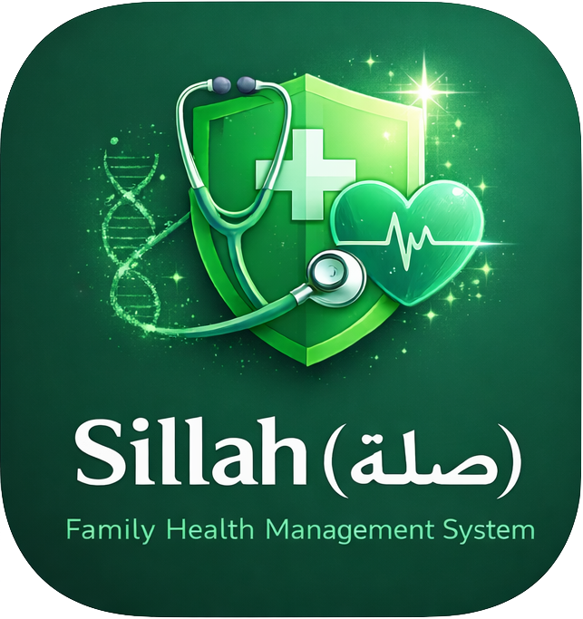

SE201 · Prince Sultan University

Sillah (صلة): Family Health Management System

A preventive health platform that helps Saudi families track hereditary cardiac risk, get smart alerts, and book care before it's urgent.

<strong>4</strong>Phases

<strong>31</strong>Requirements

<strong>10</strong>Java Classes

# SE201 – Sillah (صلة): Family Health Management System

## Prince Sultan University

**College:** College of Computer and Information Sciences (CCIS)  
**Course:** SE201 – Introduction to Software Engineering  
**Section:** 1320  
**Instructor:** Ms. Ishrat Khan  
**Submission Date:** 13 November 2025  

**Developed by:**  

- Shoug Fawaz Abdullah Alomran — 223410392  

- Aljohara Waleed A. Albawardi — 223410346  

- Aljawhara Mohammad Nasser Alruzuq — 223410216  

- Aljawharah Turki Abdullah AlSaleh — 223410217  

---

## Abstract
The **Sillah (صلة)** system is a *preventive family health management* platform that helps Saudi families identify hereditary cardiac risks using an intuitive digital tool.  
It enables users to record family medical histories, receive automated risk alerts, and schedule preventive appointments.  

This documentation outlines the complete **Software Engineering process**, from proposal and requirements to design, implementation, and testing.

---

## Phases Overview
| Phase | Title | Description |
|:------|:------|:-------------|
| **I** | Project Proposal | Goals, objectives, main features, and users |
| **II** | Requirements | Functional and Non-functional requirements |
| **III** | Design | Software architecture, UML, and design principles |
| **IV** | Prototype & Testing | Java implementation, simulation, and results |

---

> This website represents the official documentation for the *Sillah (صلة)* system — including all requirements, diagrams, code listings, and test cases as presented in the SE201 course.